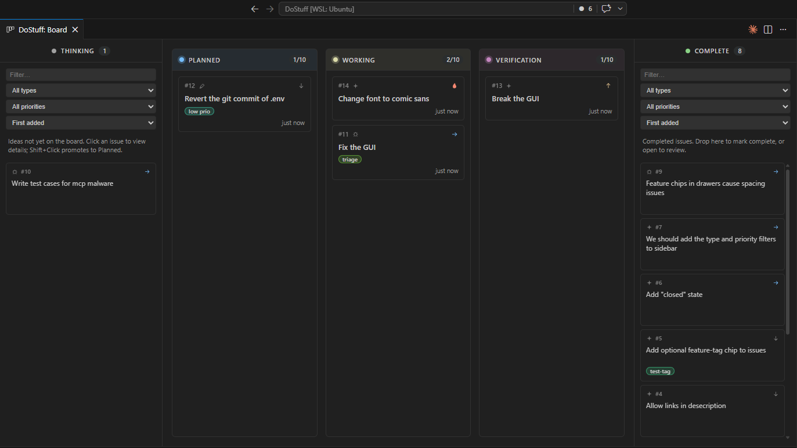

# DoStuff Issue Board

A simple software issue board for VSCode with a built-in MCP server, so coding agents can read tickets and report progress without being able to silently change scope.

Made mostly for solo devs who have trouble keeping track of things they were totally going to fix after the agent broke it.

Keeps an audit log of changes to a ticket — in case you still have the willpower to read something after reviewing the 113-file PR the agent opened.



## Install

**From the Marketplace** — search for "DoStuff" in the VSCode Extensions view and click Install.

**From a `.vsix`** — download the latest release, then in VSCode open the Extensions view (`Ctrl+Shift+X`), click the `…` menu → **Install from VSIX…**, and pick the file. Or right-click the `.vsix` in your file explorer and choose **Install Extension VSIX**.

## Quick start

1. Click the **DoStuff** icon in the activity bar — the sidebar opens with a sample ticket.
2. Hit `Ctrl+Shift+I` (or `Cmd+Shift+I`) to file a new issue. New tickets always land in **Thinking**.
3. Run **DoStuff: Show Board** from the command palette (or click the board icon in the sidebar title bar) for the full Kanban view.
4. (Optional) Enable the MCP server — **DoStuff: Toggle MCP Server** — to let coding agents read your queue and report progress. See [Using the MCP server](#using-the-mcp-server) below.

## Using the extension

### Sidebar

The sidebar lists every issue, newest first. The search box matches title, id, description, and tags; the status chips filter by lane. **Complete tickets are hidden by default** — toggle "Show completed" to reveal them.

Click any row to expand an inline detail panel for editing title, description, type, priority, status, tags, tasks, verify criteria, and attachments. Edits autosave as you type (toggleable in settings).

### Board

The board has five lanes:

```text
Thinking drawer  →  Planned  →  Working  →  Verification  →  Complete drawer
   (left)                                                          (right)
```

Drag a card between lanes to change its status. Each active lane (Planned, Working, Verification) is capped — six tickets by default; configurable via `dostuff.activeLaneCap`.

You can also start a drag in the **sidebar**. The board lights each lane and drawer with a "Move to *lane*" overlay; click any lane to drop, or press **Esc** to cancel. If the board isn't open, dragging from the sidebar opens it.

**Thinking drawer**: click a card to view its details. **Shift+Click** promotes the draft straight to Planned.

### Attachments

Each ticket has an Attachments strip in its detail panel. Drop one or more files onto it, or hit the **+** to pick via the OS dialog. Image attachments render as thumbnails — click to view full-size (Esc closes). Non-images open in VSCode via the system handler. Cap is 10 MB per file. Binaries live next to the ticket database, so the default `.gitignore` keeps them out of Git. Deleting a ticket removes its attachments too.

Attachments are exposed to MCP clients through `get_ticket`'s `attachments[]` field; agents fetch the bytes by reading `dostuff://attachments/{ticketId}/{attachmentId}`. Export/import JSON includes the metadata but not the bytes — re-upload after an import if you need them.

### Tags

Tags are free-form labels (like Jira labels), edited in the detail panel and rendered as colored chips on sidebar rows and board cards. Once a row runs out of space the extras collapse to dots. Chip colors are derived deterministically from the tag name — no per-tag setup. Sidebar search and the board drawer filter both match tag substrings.

### Links in ticket text

Description and verify-criteria text is auto-linkified. Bare `http(s)://`, `file:///`, `mailto:`, and workspace-relative `./path/to/file` references become clickable. External links open in your browser; file links and relative paths open in VSCode.

### Import / export

Run **DoStuff: Export Issues (JSON)…** or **DoStuff: Import Issues (JSON)…** from the command palette, or use the cloud icons in the sidebar title bar. The exported JSON contains the ticket data and attachment metadata — attachment bytes are not bundled.

## Workflow rules

- New tickets always start in **Thinking** for human triage.
- Only humans can promote a ticket from Thinking to Planned. Agents cannot.
- Tickets move freely between Planned, Working, and Verification.
- Only humans can move a ticket to **Complete** or **Closed** (via the UI).
- Active lanes (Planned, Working, Verification) are each capped — a workflow throttle. Finish or de-scope before starting more work. Or raise `dostuff.activeLaneCap`; I'm not your supervisor.
- **Closed** is a "won't do" state. It lives only in the sidebar (no board lane/drawer), is hidden under the **All** filter, and is reachable via its dedicated filter chip.

## Keyboard shortcuts

| Shortcut | Action |
| --- | --- |
| `Ctrl+Shift+I` / `Cmd+Shift+I` | New Issue |

## Settings reference

| Key | Type | Default | Description |
| --- | --- | --- | --- |
| `dostuff.storagePath` | string | `.vscode/dostuff` | Folder (relative to workspace root) where the SQLite database and attachments live. |
| `dostuff.writeStorageGitignore` | boolean | `true` | Write a `.gitignore` inside the storage folder so the ticket DB and attachments stay out of Git even when `.vscode/` is tracked. |
| `dostuff.autoSave` | boolean | `true` | Persist edits automatically as you type. |
| `dostuff.activeLaneCap` | number | `6` | Maximum tickets per active lane (Planned, Working, Verification). Enforced by the UI, the host, and the MCP server. |
| `dostuff.mcp.enabled` | boolean | `false` | Run an in-process MCP server that exposes the active ticket queue to local agents. |
| `dostuff.mcp.port` | number | `0` | Localhost port for this workspace's MCP server. `0` lets the OS pick an ephemeral port each session. Set a fixed value to keep `mcp.json` URLs stable. Easiest set: **DoStuff: Pin MCP Port to Workspace**. Window-scoped. |
| `dostuff.mcp.workspaceOverride` | string | `""` | Absolute path to advertise in the multi-workspace registry. Leave blank to use the first workspace folder. Window-scoped. |
| `dostuff.mcp.instructions` | string | (built-in workflow prompt) | System-level workflow prompt served alongside every ticket. Leave blank to use the default. User-level only. |

## Using the MCP server

DoStuff runs an HTTP MCP server on `127.0.0.1:<port>/mcp`. Each VSCode window binds its **own** port and writes a registry entry so agents can discover which port serves which workspace — no port collision with multiple windows open. The server is **disabled by default** — enable it with **DoStuff: Toggle MCP Server** or by setting `dostuff.mcp.enabled: true`.

Every tool response includes a `workspace` field (`{ name, rootPath }` or `null`) so agents can verify they're connected to the intended project.

### Pinning the port (_recommended_)

By default the OS picks an ephemeral port each session, so any `mcp.json` URL with a hard-coded port breaks at the next restart. To keep the URL stable:

1. Start the MCP server in this workspace (status bar shows `$(plug) DoStuff MCP :<port>`).
2. Run **DoStuff: Pin MCP Port to Workspace** from the command palette. DoStuff writes the live port to this workspace's settings as `dostuff.mcp.port`.
3. From then on the server tries to bind that exact port at every start. If the port is busy (e.g. another DoStuff window pinned it), the server falls back to an ephemeral port and logs a warning to `Output → DoStuff MCP`.

You can also edit `dostuff.mcp.port` (window-scoped, 1024–65535) by hand. Set it back to `0` to return to ephemeral.

### Looking up the live port

- **Status bar**: the `$(plug) DoStuff MCP :<port>` indicator shows the live port.
- **Registry file**: `~/.config/dostuff/instances.json` (Linux/macOS) or `%APPDATA%/dostuff/instances.json` (Windows) lists every running instance. See [Multi-workspace agent discovery](#multi-workspace-agent-discovery) below.

### Pointing a client at it

Pin the port (above), then drop it into your client config:

#### VSCode MCP settings (VS Code 1.99+)

```json
"dostuff": {
  "servers": {
    "dostuff-ticket": {
      "url": "http://127.0.0.1:<PORT>/mcp",
      "type": "http"
    }
  },
  "inputs": []
}
```

#### Claude Code

Add an entry to your `.mcp.json` (or run `claude mcp add`):

```json
{
  "mcpServers": {
    "dostuff": {
      "type": "streamable-http",
      "url": "http://127.0.0.1:<PORT>/mcp"
    }
  }
}
```

Customize the workflow prompt that agents receive with every ticket via the `dostuff.mcp.instructions` setting or the **DoStuff: Edit MCP Workflow Instructions…** command. The command pre-fills the editor with the built-in default so you can see it before editing; clearing the field and saving reverts to the default.

### Default workflow prompt

This is intentionally terse.

```text
You are an engineering agent working through the DoStuff issue queue.

Workflow contract:
  1. Tickets are addressed by number (e.g. "42") or id ("DS-042").
     Use `get_ticket` to fetch one by number, id, or a substring of its title
     i.e. "get ticket 42 and begin work" or "start on the OAuth ticket".
  2. Tickets have descriptions and verify criteria written by the human. Read before
     starting. Some tickets have subtasks to help you plan.
  3. Read `dostuff://tickets` to discover work. It lists Thinking + active-lane
     tickets (Complete and Closed are hidden). Thinking tickets are drafts the
     human hasn't triaged yet -- do not start work on them, and only a human can
     promote one to Planned. You *may* read and annotate them via
     `update_ticket_progress`: use this to record relationships ("blocks DS-042",
     "follow-up of DS-019") on a ticket you just filed with `create_ticket`, or
     to leave context for the human before they triage.
  4. When you start a ticket, call `update_ticket_status` to move it to "Working".
     When you believe it's ready for verification, move it to "Verification".
  5. You cannot mark a ticket "Complete". A human reviews Verification tickets and
     decides. If your verification fails, move it back to "Working".
  6. Active lanes (Planned, Working, Verification) are capped. Moves that would
     exceed the cap are rejected.
  7. As you make progress, call `update_ticket_progress` to tick tasks off and
     append a short note to the ticket's record. Be terse and factual.
  8. If you discover follow-up work, call `create_ticket` to file it. New
     tickets land in "Thinking" for the human to triage.

You may NOT modify a ticket's title, description, priority, type, or verify
criteria via the MCP server. If something is wrong with those, file a new
ticket instead.
```

Override this per-user via **DoStuff: Edit MCP Workflow Instructions…** or `dostuff.mcp.instructions` in Settings. Leave the setting blank to use the built-in text above.

### Tools

| Tool | Inputs | Behavior |
| --- | --- | --- |
| `get_ticket` | `query` — `#NN`, `DS-id`, or title substring | Returns the ticket plus the workflow prompt. Thinking, Planned, Working, and Verification tickets are servable; Complete and Closed are rejected. `statusHistory` and `resolvedAt` are stripped. |
| `list_issues` | optional `type`, `priority`, `status` | Returns a compact id/title index of all issues (including Thinking and Complete), filtered by any combination of type, priority, and status. Includes the workflow prompt and workspace context in every response. Use for dynamic discovery before calling `get_ticket`. |
| `create_ticket` | `title`, optional `description`, `type`, `priority`, `verifyCriteria`, `tasks[]`, `tags[]` | Files a new ticket in **Thinking** for the human to triage. Agents cannot create tickets in any other lane. |
| `update_ticket_status` | `id`, `status` (one of Planned / Working / Verification), optional `note` | Moves a ticket between active lanes. Honors the lane cap. Rejects moves out of Thinking, into Thinking, or to/from Complete and Closed. |
| `update_ticket_progress` | `id`, `taskUpdates[]`, optional `recordEntry` | Toggles `tasks[].done` and appends one record entry. **Locked**: cannot edit title, description, priority, type, or verifyCriteria. Allowed on Thinking + active-lane tickets; Complete and Closed are rejected. |

### Resources

- `dostuff://tickets` — list of Thinking + active-lane tickets (Complete and Closed hidden).
- `dostuff://tickets/{id}` — one Thinking or active-lane ticket.
- `dostuff://attachments/{ticketId}/{attachmentId}` — raw attachment bytes (base64).
- `dostuff://instructions/workflow` — the workflow prompt.

## Multi-workspace agent discovery

**TL;DR: just pin the port.**

Each VSCode window with DoStuff enabled binds its MCP server to a localhost port and registers itself in a user-global file so external agents can find the right endpoint per workspace.

- Registry file: `~/.config/dostuff/instances.json` on Linux/macOS, `%APPDATA%/dostuff/instances.json` on Windows.
- Entry shape: `{ "workspacePath": string, "port": number, "pid": number, "name": string, "startedAt": ISO8601 }`. Paths are resolved absolute and lowercased on Windows.
- Stale entries are pruned automatically on activation (via `process.kill(pid, 0)`) and removed on extension deactivation.

Recommended agent discovery algorithm:

1. Read the registry file. Treat ENOENT and corrupt JSON as an empty list.
2. Normalize `process.cwd()` the same way (resolve absolute; lowercase on Windows).
3. Filter entries whose `workspacePath` is a path-prefix of the normalized cwd; pick the longest match.
4. On a tie, prefer the most recent `startedAt`. If no entry is a prefix and the list has a single entry, fall back to it.
5. Optionally verify with `process.kill(pid, 0)` before connecting. The MCP endpoint is `http://127.0.0.1:<port>/mcp`.

If the auto-pick is wrong (e.g. an agent runs from a deeply nested cwd that doesn't share a prefix with the workspace root), set `dostuff.mcp.workspaceOverride` on that window to the path you want advertised.

## Storage

Tickets are stored in a single SQLite database — `dostuff.db` — under `<workspace>/.vscode/dostuff/` (or in VSCode `globalState` if no workspace is open). The folder is configurable via `dostuff.storagePath`. Attachment binaries live alongside the DB at `<storagePath>/attachments/<issueId>/`.

Legacy `<id>.json` ticket files from earlier versions are migrated into the DB on first launch and moved to a `legacy-json-backup/` folder next to the DB — your tickets carry over automatically.

On first use, DoStuff writes a nested `.gitignore` inside the storage folder so the DB and attachments are excluded from Git even when `.vscode/` is tracked. The gitignore itself is kept trackable (via `!.gitignore`) so teammates can see why their tickets aren't there. Disable via `dostuff.writeStorageGitignore: false`.

## Building from source

```bash
git clone https://github.com/wcole3/DoStuff
cd DoStuff
bun install
bun run package
```

`bun run package` produces a `.vsix`. In VSCode, right-click the file and choose **Install Extension VSIX**.

## License

MIT — see [LICENSE.txt](LICENSE.txt).
